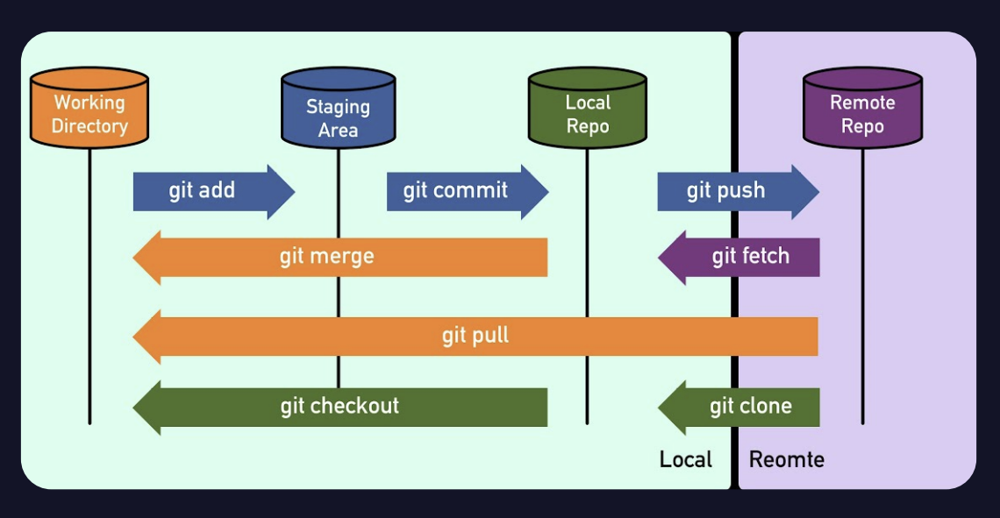

# GIT
#### 버전 관리 및 협업을 위해 사용하는 오픈소스 소프트웨어

+ ### GIT을 사용하면 알 수 있는 것
1. 어떤 파일이 수정됐는지
2. 누가 수정했는지
3. 언제 수정됐는지
4. 어떻게 수정됐는지

+ ### 파일의 생명주기

+ ### 최초 설정
1. git config --global user.name " "
2. git config --global user.email " "

+ ### 파일 관리
1. *git init* 디렉토리에 git 저장소 만들기
2. *git add* 관리 대상 등록

   |Code|Description|
   |:--:|:--:|
   |git add .|모든 파일 등록|
   |git add <파일>|하나 등록|

3. *git commit* 파일 수정 후 로컬 저장소로 옮기기
   
   |commit message type|Description|
   |:--:|:--:|
   |feat|새로운 기능 추가|
   |refactor|기존 코드 개선|
   |fix|버그 수정|
   |chore|코드 외 설정 수정|
   |docs|문서화|
   |test|테스트 코드|
4. *rm -r .git* 관리 중지
5. *git rm --cached <파일>* unstage로 되돌림

# GITHUB
#### 소프트웨어 개발 프로젝트를 위한 소스코드 관리 서비스

+ ### GITHUB에서 가능한 것
1. 이슈 트래킹
2. 코드 리뷰
3. Github Actions로 CI/CD
4. Github Projects로 프로젝트 업무 관리

+ ### GIT/GITHUB 흐름

+ ### GITHUB 올리기 전
1. git remote add origin <주소>
2. git branch -M main
3. git push -u origin main
   
+ ### GITHUB에 올리기
1. git add <파일>
2. git commit -m "commit message"
3. git push origin main
   

___

[GIT/GITHUB를 활용한 실습](https://github.com/pm0512/pm0512)
